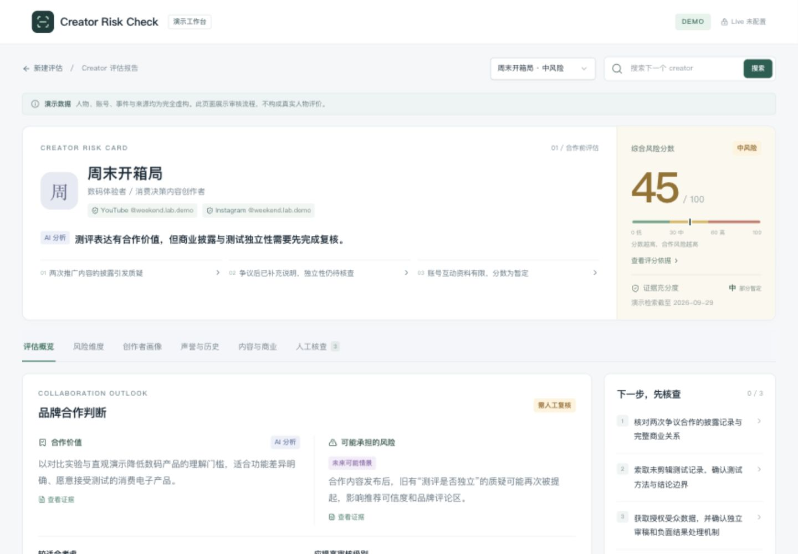
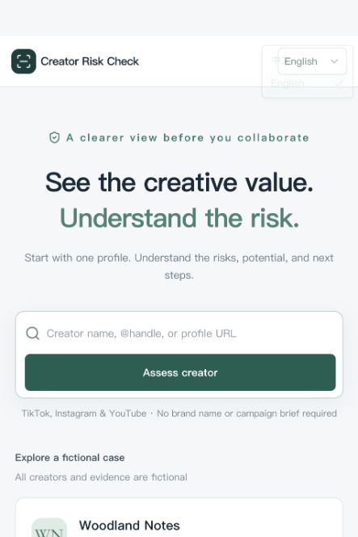
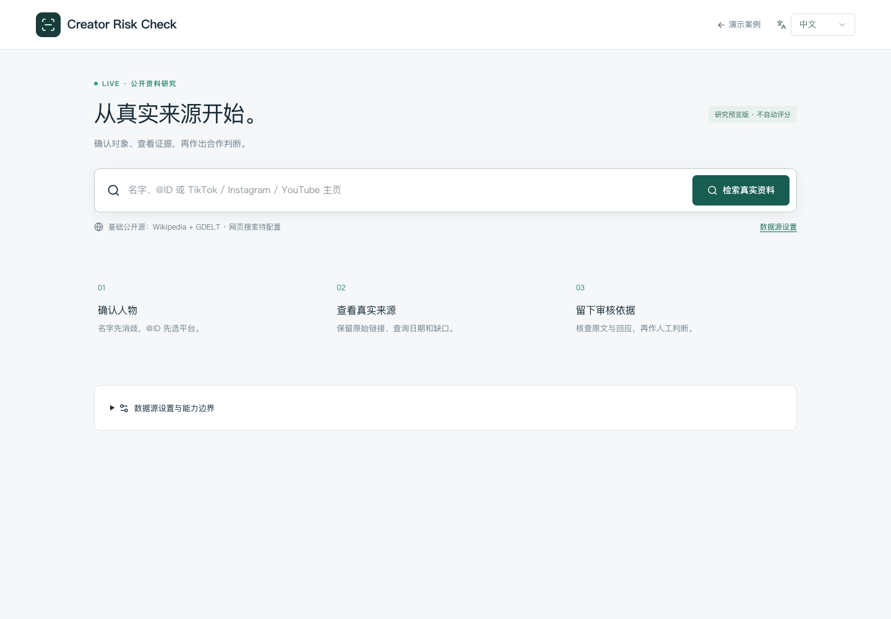

# Creator Risk Check

A bilingual portfolio prototype for reviewing creator partnerships with visible evidence, uncertainty and human judgment.

[中文说明](README.zh-CN.md) · [Product decisions](docs/CASE_STUDY.md) · [Verification and limitations](qa/PUBLIC_RELEASE.md)



## Try the demo locally

Requires Node.js **22.13 or newer** and npm. No API key is needed for the fictional demo.

```sh
git clone https://github.com/cocoinanut/creator-risk-check.git
cd creator-risk-check
npm ci
npm run dev
```

Open the local address printed in the terminal (normally http://localhost:5173). Choose **English** in the language selector. Select a sample creator, inspect the evidence, and record a reasoned human decision.

Try `Woodland Notes`, `Weekend Lab` or `Aran Outdoors`. Their identities, sources and scores are entirely fictional. A real name never receives a fictional report.

## Two separate workspaces

| Workspace | What works | Boundary |
| --- | --- | --- |
| Demo `/` | Three fictional cases, six risk dimensions, evidence drawers, historical context, local review notes, Chinese / English | Scores are designed examples, not trained predictions or probabilities |
| Public-source research `/live` | Identity selection, public search adapters, coverage and error reporting, manual evidence review, JSON export | No automated scoring, account verification, social-platform comments or audience demographics |

No hosted demo URL is claimed in this release. Publishing this repository makes the source and screenshots accessible; it does not deploy a public service.

## Why this design

Missing evidence is not treated as low risk. Same-name accounts are not merged automatically. Source excerpts remain leads for review, and the reviewer must explain a changed decision. See [the case study](docs/CASE_STUDY.md) for the design logic and its limits.





## Optional public-source research

Wikipedia and GDELT adapters require no key. Brave Search is optional:

```sh
cp .env.example .env
```

If `.env` already exists, edit it instead of overwriting it. Set `BRAVE_SEARCH_API_KEY` and restart. Keep keys server-side; never commit `.env` or `.dev.vars`. Search terms are sent to the selected providers. Availability, coverage and provider limits vary.

A provider outage returns an explicit coverage gap, never invented evidence. Successful live-source end-to-end acceptance with a configured Brave key remains outstanding. This prototype should not be presented as an autonomous commercial risk service.

## Privacy and data

The repository uses fictional demo material and public-source adapters. It is not a distribution of employer/client research, private transcripts or internal templates. Review notes remain in the current browser's localStorage; clearing site storage removes them. JSON exports may contain your notes and retrieved material: review them before sharing. There is no multi-user storage or account system.

Public hosting of Live requires access controls, durable rate limiting and provider spending limits. The local in-memory limiter is not a distributed quota system.

## Verify and build

```sh
npm test
npx tsc --noEmit
npm run build
npm run start
```

`start` serves the Cloudflare build locally. This project uses React, TypeScript, Vinext/Vite and Cloudflare Workers; it is not a drop-in standard Next.js deployment.

## Repository guide

- `app/page.tsx`: fictional review workspace.
- `app/live/`: public-source research and human review.
- `lib/demo-data.ts`: fictional evidence and transparent scoring rules.
- `lib/live/search.ts`: fixed-provider retrieval and safe input parsing.
- `tests/`: scoring, identity, provenance and API boundary checks.
- `qa/`: screenshots and dated verification. Earlier screenshots depict the demo, not Live acceptance.

This is an AI-assisted portfolio prototype. Product behavior, test results and unfinished capabilities are documented separately from claims of real-world impact. Third-party components retain their own licenses; no additional reuse license is granted for original project code in this release.
